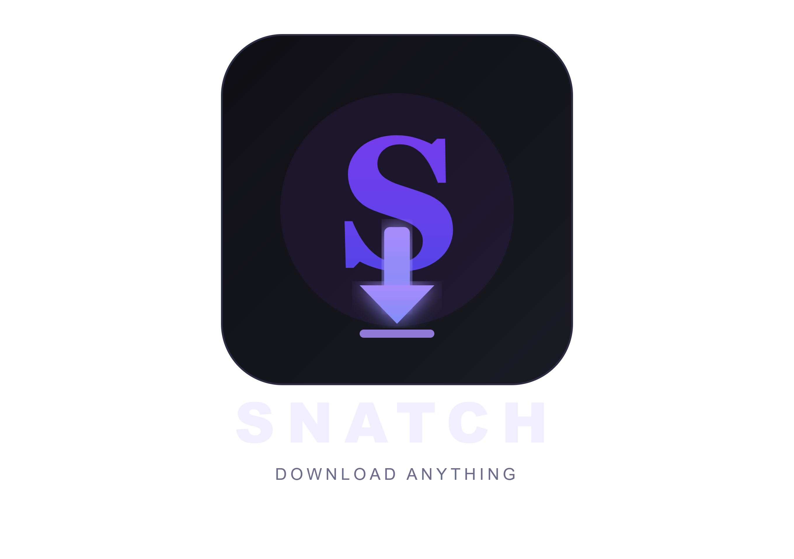

<div align="center">
  

  # Snatch Video Downloader
  **A powerful, multi-platform video and audio downloader for iOS and Android.**
  
  []()
  []()
  []()
</div>

---

## 🌟 About The App

**Snatch** is a completely free, open-source application designed to download media across your favorite platforms. Available for mobile and desktop, it features a native media player and automatic URL detection to make saving videos as frictionless as possible.

### ✨ Key Features
- **Multi-Platform Support:** Download videos and audio from YouTube, TikTok, and Instagram on Android, iOS, Windows, and macOS!
- **High Definition:** Support for true 1080p, 1440p, and 4K YouTube video streams.
- **In-App Browser:** Browse websites normally and hit "Download" to fetch the media on the page *(Mobile only)*.
- **Built-in Media Player:** Watch and listen to your downloaded content instantly without leaving the app.
- **Smart Intent Sharing:** Share links directly from the YouTube/TikTok/Instagram app to Snatch for instant downloading *(Mobile only)*.
- **Background Downloads:** Robust download manager with cancel, retry, and background support.

---

## 🤝 Credits & License

- **Created by:** Afaq Raza
- **Designed by:** Mafaz Noor

> **Open Source & Non-Commercial Use**  
> Snatch is completely free and open to everyone. If you want to edit, modify, or fork this software to suit your own needs, you are highly encouraged to do so! We only ask that you **give proper credit** to the original creators. *Please note: This software is strictly for non-commercial use.*

---

## 🚀 Installation

### 🤖 For Android
Download the latest `snatch-v1.5.0_release.apk` from the [Releases](../../releases) tab, enable **Install from unknown sources**, and install it directly on your device.

### 🍏 For iOS (Sideloading)
1. Download the `Snatch-iOS-Unsigned.ipa` from the [Releases](../../releases) tab.
2. Download and install [Sideloadly](https://sideloadly.io/).
3. Drag the `.ipa` into Sideloadly, input your Apple ID, and click **Start**.
4. Go to **Settings > General > VPN & Device Management** on your iPhone and tap **Trust**.

### 🪟 For Windows
1. Download the `Snatch-v1.5.0-Windows.zip` from the [Releases](../../releases) tab.
2. Extract the `.zip` file into a folder on your computer.
3. Double-click `save_it.exe` to run the app. No installation required!

### 🍎 For macOS
1. Download the `Snatch-v1.5.0-macOS.zip` from the [Releases](../../releases) tab.
2. Double-click the `.zip` to extract the `save_it.app` file.
3. Drag the app into your **Applications** folder and run it!

---

## 🛠️ Development Setup

To build this project from source, ensure you have [Flutter](https://flutter.dev/docs/get-started/install) installed.

```bash
# Clone the repository
git clone https://github.com/Afaqraza12/Snatch-video-Downloader.git

# Navigate to the project directory
cd Snatch-video-Downloader

# Get dependencies
flutter pub get

# Run the app
flutter run
```
